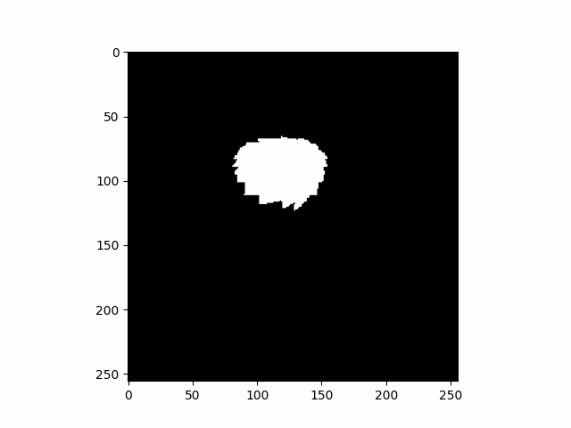
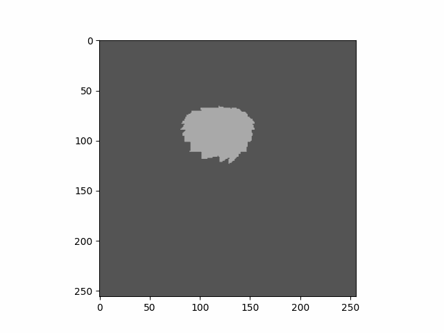

# SegmentationToScribble
Convert segmentation binary mask into scribble binary mask

### Example
**Segmentation**  

**points scribbles** (positive points in white, negative points in black, points has been dilated for better visualization)  

**skeleton scribbles** (skeleton in white, skeleton has been dilated for better visualization)  

# Special requirements
In addition to the usual dependencies, we use the following libraries :
* [NumPyDraw](https://github.com/Cyril-Meyer/NumPyDraw)  
Draw 2D and 3D shapes into NumPy array. (submodule)
* [NumPyRandomShapes3D](https://github.com/Cyril-Meyer/NumPyRandomShapes3D)  
Generate 3D NumPy array with random shapes. (submodule)
* [euclidean-distance-transform-3d](https://github.com/seung-lab/euclidean-distance-transform-3d)  
Multi-Label Anisotropic 3D Euclidean Distance Transform. (pip install)
